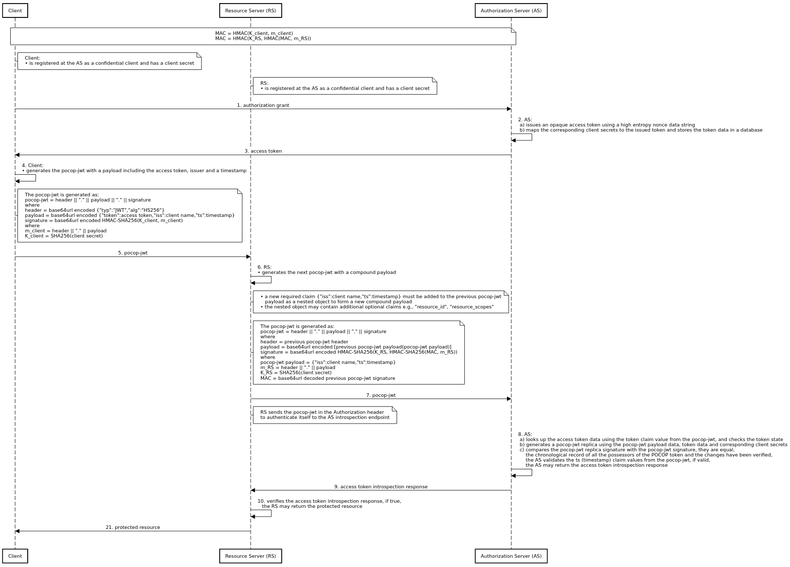
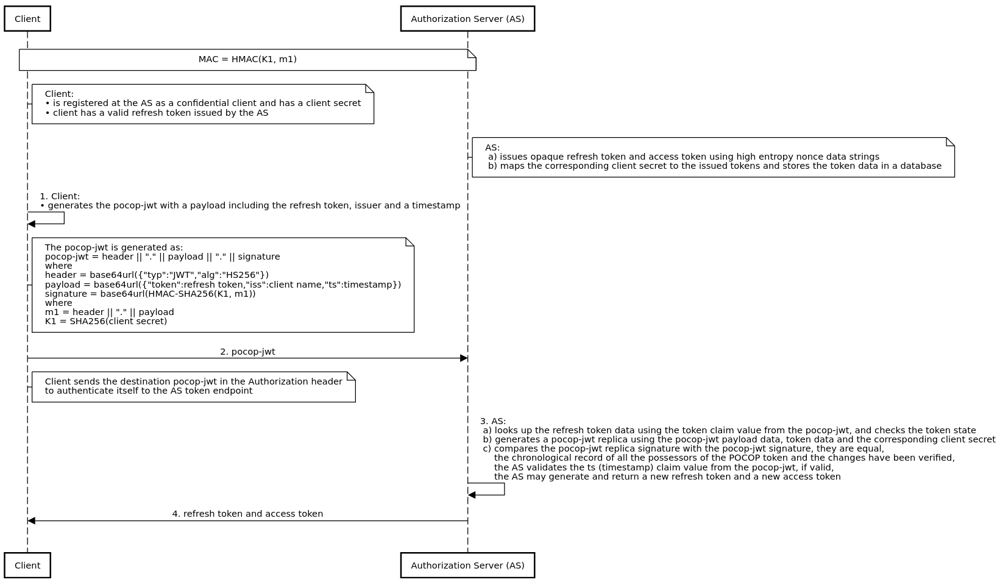

# UMA JWT

### OAuth2 POCOP Access Tokens

### OAuth2 POCOP Refresh Tokens

### UMA POCOP Tickets

Chained Resource Servers (TBD)

## Acknowledgment

Credits go to [WG - User-Managed Access][1].

[1]: https://kantarainitiative.org/confluence/display/uma/Home